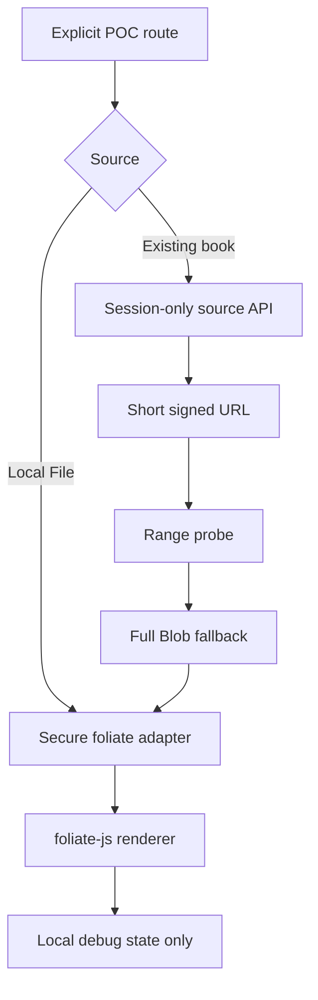

# Xiaxia Reading House · foliate-js Controlled POC Report

Date: 2026-08-28  
Scope: Phase 0 + Phase 1 only  
Production reader: unchanged and still the default

# Decision

## PENDING USER VALIDATION

This means **the Phase 2 promotion gate cannot yet be decided from the evidence
currently available**. It is neither a PASS nor a technical FAIL.

The strict gate remains pending because the supplied corpus contains 3 rather than at
least 10 real EPUBs, contains no two labelled legacy-success books and no four
blind books, and because the Xiaxia POC could not be executed on Android Chrome
or real iPad Safari in this environment. CFI restore, internal link/footnote
navigation, private signed-source delivery, browser memory and hostile-EPUB
execution therefore do not yet have qualifying device evidence.

Do not start Phase 2 from this report. Do not remove the legacy reader. The
result also does **not** justify immediately abandoning foliate-js for Readium:
all three previously failing EPUBs produced a positive direct-open signal in a
real Desktop Chrome engine demo without modifying the books.

## What the current evidence does prove

The upstream foliate-js demo was exercised in Desktop Chrome with the three
supplied, previously failing EPUB files. All three opened directly from local
File, displayed the correct title, exposed a TOC, and permitted basic page
movement; pagination-to-scroll switching was also exercised on the EPUB2
samples. No publisher- or filename-specific workaround was used.

This establishes the core A/B result:

> Reading House importer failure does not imply that foliate-js cannot load the
> original publication.

It does not yet establish production readiness.

## 1. Pinned upstream

| Field | Value |
|---|---|
| Repository | <https://github.com/johnfactotum/foliate-js> |
| Commit | `78914aef4466eb960965702401634c2cb348e9b1` |
| Commit date | 2026-05-01T19:24:25Z |
| Commit subject | `Use original hrefs for external links and add isExternal in fb2.js (#129)` |
| Package version | `0.0.0` (upstream has no stable release version) |
| License | MIT |
| Embedded zip.js | 2.8.22, BSD-3-Clause |
| Local upstream patches | **0** |

The POC vendors only the EPUB dependency closure. Upstream files are
byte-for-byte copies and their SHA-256 values are enforced by tests. MIT and
BSD-3-Clause license texts are retained beside the source.

## 2. Isolation architecture

- `/reader/<book_id>` still renders the legacy `reader.html` and `reader.js`.
- `/reader-engine-poc` opens a local EPUB File and bypasses importer, database
  and Storage.
- `/reader-engine-poc/<book_id>` requests the existing raw
  `books.source_object_path` through a Web-session-only API.
- `READER_ENGINE_POC_ENABLED` defaults to `false`; when disabled, all POC
  routes return 404.
- No link was added to the production library or reader UI.
- The POC never calls annotation, Thought, Reply, progress, completion or V2
  memory write endpoints.

## 3. Source delivery result

### Path A — signed URL + Range

The POC endpoint creates a private Supabase signed URL with a TTL constrained
to 60–300 seconds and returns it with `Cache-Control: no-store`. The browser
performs a `Range: bytes=0-0` probe and records status, `Accept-Ranges`,
`Content-Range`, `Content-Length` and latency.

However, the pinned foliate-js `view.open(url)` implementation calls `fetch`
and materialises the complete response as a `File`. Its vendored zip.js bundle
exports Blob readers, not a remote `HttpReader`. Therefore the POC deliberately
does not label URL loading as Range rendering.

Live Supabase CORS/206 behaviour was not testable because no production
credentials were available in the workspace. Path A end-to-end status is
**NOT EXECUTED**.

### Path B — Full Blob

Implemented. The POC downloads the signed source once, records duration and
size, converts it to a File, and opens it through the pinned engine. The three
real files were directly opened in the upstream Desktop Chrome demo through
the equivalent local File/Blob engine path.

The expected memory tradeoff is explicit: compressed EPUB bytes remain in
browser memory while the ZIP reader and currently loaded publication sections
also consume memory. Close calls both renderer cleanup and `book.destroy()`;
the page records a post-close memory sample where Chromium exposes
`performance.memory`.

## 4. Real corpus currently available

| File | Size | EPUB | Spine | XHTML | Images | Fonts | TOC | Noteref refs | Direct open |
|---|---:|---:|---:|---:|---:|---:|---|---:|---|
| 卡瓦菲斯诗集＋当你起航前往伊萨卡 | 712,008 B | 2.0 | 327 | 327 | 4 | 0 | NCX | 0 | PASS (engine-only) |
| 唐诗选注 | 4,306,793 B | 2.0 | 87 | 87 | 181 | 0 | NCX | 0 | PASS (engine-only) |
| 唐诗选（全二册） | 927,996 B | 3.0 | 72 | 73 | 123 | 0 | NAV | 2,011 | PASS (engine-only) |

Structural inventory used only read-only ZIP/OPF inspection; no EPUB was
rewritten. All three have `missing_manifest_items=0`. The Kavafis book is the
high-small-section case (327 XHTML); `唐诗选注` and `唐诗选（全二册）` cover
image-heavy publications; the latter is the main real footnote corpus.

This is 3 real books, not the required 10. There are no labelled blind books or
known-success books in the supplied workspace, so no corpus success percentage
is reported.

## 5. Publication, pagination and scroll observations

Observed in a real Desktop Chrome cloud browser against the upstream demo at
<https://johnfactotum.github.io/foliate-js/reader.html> while upstream `main`
resolved to the pinned commit during the audit:

- all three books displayed their real title;
- Kavafis exposed its two top-level NCX groups and advanced from Loc 0 to Loc 1;
- `唐诗选注` exposed its long poet TOC, advanced the progression value, and
  accepted the Scrolled layout switch;
- `唐诗选（全二册）` exposed 71 TOC tree items and advanced the progression
  value after paging;
- no source file was edited and workaround remained `NONE`.

These are basic engine signals. They are not counted as qualifying tests for
font reflow, resize, orientation, image completeness, CFI selection/restore,
internal links, footnotes, or memory stability.

## 6. CFI, selection and decoration implementation

The POC records on selection:

- section index;
- original section href;
- selected quote;
- generated EPUB CFI.

It can store the CFI in local debug state, call `goTo(CFI)`, and render an
in-memory highlight using foliate-js `addAnnotation` and `Overlayer.highlight`.
It exposes a constrained `window.__FOLIATE_POC__` test surface for automated
selection, restore, ten-section traversal, memory snapshots and close. No
production annotation row is written.

The code and automation path are present; qualifying Chrome/Safari restore
results are **NOT EXECUTED** in this environment.

## 7. Internal links and footnotes

The adapter observes foliate-js `link` and `external-link` events without
rewriting publication-relative paths. Internal links retain the engine's native
`resolveHref → goTo` path. External links are blocked in the POC.

Noteref classification is diagnostic only (`epub:type=noteref` and
`role=doc-noteref`). The engine remains responsible for target resolution and
history; the POC provides Link Back through `view.history.back()`. A future
Reading House footnote paper would be product UI above this event layer.

No current Reading House path rewriter is used. Same-file, cross-file,
backlink, encoded href and missing target require device execution before this
section can pass.

## 8. Security

EPUB content is treated as untrusted.

The Xiaxia adapter:

- rejects manifest JavaScript before resource load;
- strips inline `<script>`, iframe/frame/frameset, object/embed/applet, `<base>`
  and meta refresh;
- removes inline event attributes, `srcdoc` and `javascript:` URLs;
- blocks external-link navigation;
- runs under a POC-only CSP with `script-src 'self'`, `object-src 'none'`,
  `frame-src blob:`, `worker-src 'none'`, exact Supabase connect origin, no
  referrer and no cache;
- never returns the service-role key.

A generated hostile EPUB contains external/inline script, onload, iframe
script and a JavaScript link. The browser automation asserts that none of five
execution flags becomes true. The fixture and test are delivered, but the
browser security run is **NOT EXECUTED** here because the local browser binary
could not be installed and Cloud Browser cannot access local HTTP origins.

## 9. Browser and memory status

| Target | Status | Evidence |
|---|---|---|
| Desktop Chrome engine-only | PARTIAL PASS | 3/3 real files opened in upstream demo; basic TOC/page/scroll signals |
| Desktop Chrome Xiaxia POC | NOT EXECUTED | local Playwright binary download returned truncated 0 MiB archives |
| Android Chrome | NOT EXECUTED | real device required |
| iPad Safari | NOT EXECUTED | real device required |
| Memory growth | NOT EXECUTED | sampling code exists; no qualifying ten-section/device trace |

Cloud Browser could reach the official demo but could not access the local POC
(`ERR_BLOCKED_BY_CLIENT`). The local Playwright runtime existed but its browser
binary download repeatedly failed with a truncated ZIP. These limitations are
recorded rather than converted into product results.

### Automated regression

- Complete project suite: `119 passed`.
- POC-specific Flask/boundary suite: `11 passed`.
- Python compilation: passed for all application and POC modules.
- JavaScript syntax: passed for legacy scripts, POC scripts, browser harness
  and the vendored foliate-js dependency closure.
- Hostile EPUB generation and ZIP integrity: passed.

These checks establish isolation and code integrity; they do not replace the
missing real browser/device evidence above.

## 10. Deployment changes

| Area | Change |
|---|---|
| New environment | `READER_ENGINE_POC_ENABLED=false`; optional TTL defaults to 180 |
| Database migration | None |
| Supabase schema/bucket | None; bucket remains private |
| Node/npm runtime | None |
| Render build command | Unchanged |
| Render start command | Unchanged |
| Custom GPT/OpenAPI | Unchanged |
| Production reader | Unchanged |

The only runtime addition is static ES modules vendored in the Flask static
tree. Node + Playwright are optional POC test tooling, not deployment
dependencies.

## 11. Upstream limitations observed

1. No stable tagged package version; commit pinning is mandatory.
2. URL opening downloads the complete book; true remote ZIP Range reading is
   not present in the pinned vendor closure.
3. Upstream paginator uses an iframe sandbox containing both
   `allow-same-origin` and `allow-scripts` for a WebKit event bug. Xiaxia must
   keep its adapter sanitizer and CSP; upstream defaults alone are not an
   acceptable untrusted-content boundary.
4. API surface is not declared stable and remains a maintenance risk.
5. Browser memory visibility is approximate and unavailable in Safari through
   `performance.memory`.

## 12. Required evidence before re-decision

1. Supply at least 7 more real EPUBs: at least 4 genuinely blind, plus 2 books
   known to work in the legacy reader.
2. Deploy with the POC flag on temporarily; do not change the default reader.
3. Run every book through Local File and, where it already exists in Reading
   House, through the signed Storage path; export each JSON result.
4. Complete Desktop Chrome, Android Chrome and the real iPad Safari checklist
   in `FOLIATE_POC_TEST_MATRIX.md`.
5. Attach the exported JSON files. Recompute ≥90% compatibility and ≥3/4 blind
   success without any book-specific workaround.

Only after those five items may the Decision change to PASS or become a
technical FAIL that justifies a Readium TS Toolkit + Publication Server POC.

## Direct answers

1. **Is foliate-js clearly better than the current custom Web engine?**  
   Preliminary yes for source compatibility: 3/3 previous importer failures
   directly opened. Production readiness is not proven.

2. **Can the previous failed EPUBs open directly?**  
   Yes, all three produced real Desktop Chrome direct-open results with no EPUB
   modification. Full feature qualification is incomplete.

3. **Is it ready for formal Xiaxia migration?**  
   Not yet. The current Decision is PENDING USER VALIDATION at the Phase 2 gate.

4. **Should Source-first Import + `publication_ready/text_index_ready` begin?**  
   No. That is Phase 2 and remains prohibited until the gate passes.

5. **Should the project immediately switch to Readium POC?**  
   No—not from missing evidence. Switch only if the completed corpus/device
   matrix exposes a structural foliate-js failure or the final gate remains
   below threshold.
