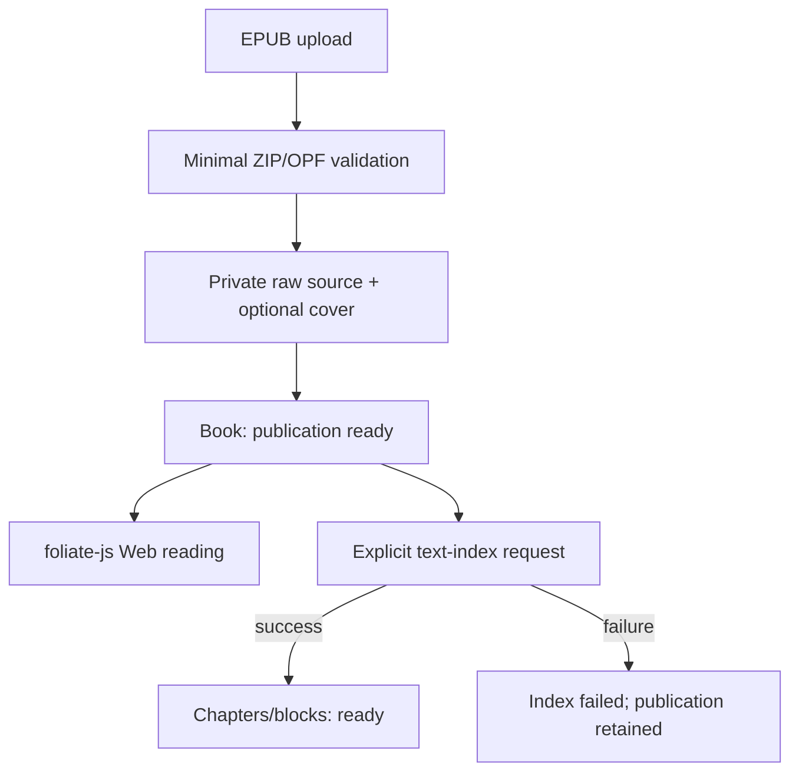

# Xiaxia Reading House · Phase 2 Source-first Report

## 结论

Phase 2 在当前代码与可用真实样本范围内 **PASS**。

新的 EPUB 主路径已把两个事实拆开：

- `publication_ready`：原始 EPUB 已通过最小安全校验、保存到 private Storage，Web
  reader 可以用固定版本 foliate-js 打开。
- `text_index_status`：夏夏所需的 chapters/content_text/blocks 是否已经独立完成。

三个此前真实导入失败的 EPUB 均在不改 EPUB、不加书名/出版社分支、workaround 为
`NONE` 的条件下完成 source-first publication 创建。text index 的失败、超时与重试
均不会删除 book 或 raw EPUB。正式生产 Supabase/Render 尚未由此执行环境代替用户
部署；真实 provider 网络时延与生产 smoke test 必须在迁移和部署后确认。

## 新导入架构



### Publication transaction

1. request stream 以 1 MiB 分块写入临时文件并同步计算 SHA-256；不调用整本
   `upload.read()`。
2. 最小校验只读取 ZIP directory、container/OPF、manifest/spine、metadata 与可选
   cover。安全限额为 50 MiB request、20,000 entries、512 MiB 解压总量、128 MiB
   单 entry、300:1 压缩比。
3. 先保存一个 raw EPUB object；封面最多额外保存一个 object。封面缺失或提取失败
   降级为无封面，不影响 publication。
4. 单个 PostgreSQL 事务创建 book 与可选 cover metadata，状态为
   `publication_ready=true / reader_engine=foliate / text_index_status=pending`。
5. Storage 失败时不建 book；DB 创建失败时删除本次 source/cover。只有这两类失败会
   撤销整本 publication。

主上传请求不再做完整 XHTML normalization、不再创建 chapters、不再为 Web reader
复制所有图片/字体/CSS，也不等待 AI chunks。上传成功语义变为“已加入书架”。

### Text-index transaction

`POST /api/books/{book_id}/text-index` 从已有 `source_object_path` 流式下载 EPUB，调用
保留的 `epub_parser.py`，但使用 `include_assets=false`。normalized chapter HTML/text
先落临时文件，随后在一个 DB 事务中批量建立 chapters、legacy progress 与 AI state。

解析、资源、超时或 DB 异常只更新 text-index failure 状态，不调用 book/source
delete。成功后原子切到 `ready`。进程内 semaphore 限制同时只整理一本书；处理超过
15 分钟的 `processing` 状态可被下一次 retry 接管。没有引入 Celery、Redis、MQ 或
后台常驻线程。

## 状态机

| 状态 | Web 阅读 | Xiaxia chapter/chunk | 用户可见语义 |
|---|---|---|---|
| publication false | legacy/不可用 | 取决于旧数据 | 不宣称原书可用 |
| publication true + pending | foliate 可读 | `text_index_not_ready` | 夏夏正在整理 |
| publication true + processing | foliate 可读 | `text_index_not_ready` | 夏夏正在整理 |
| publication true + ready | foliate 可读；可回退 legacy | 正常 | 正常书籍 |
| publication true + failed | foliate 可读 | `text_index_failed` | 可阅读，夏夏暂不能完整读取 |

稳定 text-index 错误码：

- `text_index_parse_failed`
- `text_index_timeout`
- `text_index_resource_limit`
- `text_index_no_readable_text`
- `text_index_mapping_failed`
- `text_index_internal_error`

## 数据库变更

新增可重复执行的 additive migration：
`migrations/006_reader_engine_source_first.sql`。

`books` 新增：

- `publication_ready`
- `reader_engine` (`legacy` / `foliate`)
- `text_index_status` (`pending` / `processing` / `ready` / `failed`)
- `text_index_failure_code`
- `text_index_failure_detail`（只在后端调试使用）
- `publication_validated_at`
- `text_index_updated_at`

另增 `publication_reading_progress`，保存 foliate locator/progression。没有修改原
`reading_progress`，因为其 `chapter_id` 非空且属于 legacy block anchor；强塞 CFI 会
提前进入被本轮禁止的 dual-anchor migration。

Migration 不删除、不重命名、不重写 anchor。现有有 chapter text 的书回填
`text_index_status=ready`；有 `source_object_path` 的书回填 publication ready；没有
source path 的书保持 publication false。所有旧书固定为 `reader_engine=legacy`，所以
历史 annotation、Thought、shared stops 与 progress 仍由原 DOM/block 体系负责。

## Retry、幂等与事务边界

- Retry 复用 raw source，不重新上传。
- 上一次没有稳定痕迹的不完整 chapters/progress 在新 text-index 事务内清理再写入；
  事务失败会整体回滚，因此不会留下半索引。
- 已有 annotation 或 Xiaxia Thought 且已有 chapters 时，返回
  `text_index_mapping_failed`，不会删除历史锚点数据。
- 已经 ready 的请求直接返回现状；并发 processing 返回
  `text_index_in_progress`。
- source SHA-256 重复时不创建第二本书，返回原 book_id，并提示可以重试整理。

## Reader 与 fallback

- `READER_ENGINE_ENABLED=false`（默认）：现有 reader 与 EPUB importer 均维持 legacy。
- 开关为 true 时，新 EPUB 使用 source-first，且只有
  `publication_ready + reader_engine=foliate` 的书进入正式 adapter。
- `/reader/{book_id}` 的顶栏、目录 drawer、纸页 shell、视觉 CSS 与 URL 均保留；没有
  引入 Foliate demo UI、React、Node runtime 或 npm build。
- 业务脚本只调用 `FoliateReaderAdapter` 的 open/close/goTo/next/previous/flow/
  preferences/locator/events 接口，不散布 upstream internals。
- foliate runtime 异常且 text index ready 时，自动用 `?engine=legacy` 回退。旧书始终
  legacy；source-less legacy book 不会被送入 foliate。
- Phase 3 前 foliate reader 是阅读/导航/进度可写、annotation/Thought 只读 gate。
  Selection 会显示克制提示，但不会创建只有 CFI、现有系统无法理解的痕迹。

## Private source 与安全

已登录 Web session 才能调用 `GET /api/books/{book_id}/source-access`。服务器使用
service-role 创建 60–300 秒 signed URL；响应 `Cache-Control: no-store` 与
`Referrer-Policy: no-referrer`，前端 bundle/HTML/API payload 不含 service-role key。

Reader CSP 限制 script 为 self、object 为 none、frame 为 blob，connect 只允许 self/
blob/当前 Supabase origin。继续使用 POC 已验收的 sanitizer/sandbox adapter：EPUB
script、inline handler、iframe/object 与 `javascript:` URL 不执行。固定 upstream
commit 仍是 `78914aef4466eb960965702401634c2cb348e9b1`，upstream patch 为 0。

## Existing books、AI 与 V2

- 已有书不重新导入、不改 engine、不改 chapter 顺序或 block ID。
- source-backed old book 只是未来候选，本 migration 不自动切换 renderer。
- source-less old book 永久保留 legacy fallback，除非将来由用户重新提供原 EPUB。
- AI ingestion 继续读取现有 chapters/content_text/blocks/chunks；不从 foliate iframe
  抓文本。
- chapter list、chapter、reading context 与 AI progress 在 index 未 ready 时返回稳定
  machine-readable readiness，而不是 404/500。
- `openapi.yaml` 未修改，现有 Custom GPT operationId/path 不变；readiness 字段只是
  backend 向后兼容扩展。
- annotation/Thought/Reply、Preview→Commit、Undo、双方进度、shared stops、封底、
  双盲评价、信、时间线和印章的表与算法均未修改。

## 真实失败 EPUB 结果

每本书用独立 Python 进程运行 `scripts/validate_source_first_real_epubs.py`。该脚本调用
生产 `create_epub_publication()`；只把 Supabase/PostgreSQL 替换为有界本地 sink，避免
需要生产 secret 或写真实数据。text index 随后从已持久化 raw source 读取，并关闭
full asset extraction。

| EPUB | 版本 | 压缩 / 解压 | entries / XHTML / images | publication | 初始 index | publication ms* | text ms | chapters / blocks | peak RSS | Web asset rows | workaround |
|---|---:|---:|---:|---|---|---:|---:|---:|---:|---:|---|
| 卡瓦菲斯诗集＋当你起航前往伊萨卡 | 2.0 | 0.71 / 1.88 MB | 337 / 327 / 4 | PASS | pending | 23 | 4530 | 323 / 15056 | 103.21 MB | 1 | NONE |
| 唐诗选注 | 2.0 | 4.31 / 4.98 MB | 274 / 87 / 181 | PASS | pending | 35 | 1125 | 85 / 3403 | 80.86 MB | 1 | NONE |
| 唐诗选（全二册） | 3.0 | 0.93 / 1.74 MB | 201 / 73 / 123 | PASS | pending | 14 | 2743 | 71 / 5065 | 95.24 MB | 1 | NONE |

\* publication 时间使用本地 bounded Storage/DB sink，只证明主路径与内容复杂度解耦，
不代表 Supabase 网络时延。三本均只保存 raw source + 1 个可选 cover，不为 Web reader
复制 123/181 张图片。三本 text index 也成功，但即使其中任何一本失败，publication
结果仍为 PASS。

## Production hotfix：psycopg3 batch compatibility

生产 traceback 证明 Phase 2 首版在 text-index DB 阶段错误调用了
`Connection.executemany()`。项目使用 psycopg3：`Connection.execute()` 是受支持的
便捷 API，但批量 `executemany()` 属于 `Cursor`。

Hotfix 在 `database.py` 增加单一 `execute_many()` 边界，内部使用：

```python
with conn.cursor() as cursor:
    cursor.executemany(query, params)
```

`source_first.py` 的 chapter batch 在既有 `db.transaction()` 内调用该边界。cursor
异常继续向外传播，由外层 transaction rollback；随后只更新 text-index failure
状态，不删除 publication 或 raw EPUB。其余 `conn.execute()`、pool connection 与
transaction pattern 已核对为合法 psycopg3 用法，没有机械替换。

兼容性测试直接检查安装中的 `psycopg.Connection` 没有 `executemany`、
`psycopg.Cursor` 提供 `executemany`；完整 text-index 测试使用一个明确没有
`executemany` 的 Connection contract，通过 `cursor.executemany` 完成批量章节写入。

## 自动化与静态验证

执行结果：

- `pytest`: **140 passed, 0 failed**
- Python `py_compile`: PASS
- 所有项目/测试/vendored `.js` 的 `node --check`: PASS
- 三本真实失败 EPUB source-first validation: **3/3 PASS**
- `openapi.yaml` SHA-256 保持
  `27b645bea52d6cb92f3bdc25729388b56b116e094c2b106bd6ef0269d7a319bf`
- requirements 未新增 Node、queue 或后台服务依赖

当前受控环境没有预装 Ruff，且网络审批不允许临时下载，所以没有把 Ruff 冒充为已
运行；Python 编译、完整测试、JS syntax 与基础 whitespace/conflict-marker 检查作为
本次可执行静态验证。部署环境如有 Ruff，可额外运行 `ruff check .`。

## 已知限制

1. Text index 是用户显式触发的同步 maintenance request。它已移出主上传关键路径，
   但大书整理本身仍可能遇到 Render hard kill；此时 publication 不受影响，processing
   超过 15 分钟后可重试。
2. 新 foliate 书在 Phase 3 前不写正式 annotation/Thought。不能以“书可读”为理由
   提前写入单 CFI 数据；同样不会用 publication progression 冒充 legacy 最后一章
   block completion，因此新 foliate 书的“合上正文”入口暂时隐藏。旧书的全部 V2
   completion/封底链路不变。
3. 当前固定 foliate loader 仍走 Full Blob；signed URL 的真正随机 Range reader 不是
   Phase 2 的前置条件。
4. Migration 只能验证 `source_object_path` 非空，无法在 SQL 内证明 Storage object
   实际仍存在；source access 失败会安全返回 `publication_source_unavailable`，旧书仍
   保持 legacy。
5. 本报告不宣称 Phase 2 已在用户真实 Supabase/Render 完成部署；上线后仍需执行下面
   smoke checklist。

## 部署与回滚

1. 备份 Supabase PostgreSQL。
2. 执行 `migrations/006_reader_engine_source_first.sql`；不要重跑 `schema.sql`。
3. 部署完整项目。Build Command 与 Start Command 不变：1 worker、2 threads、120 秒。
4. 保持 `READER_ENGINE_ENABLED=false`，确认 legacy 旧书、annotation、Thought、V2 正常。
5. 设 `READER_SOURCE_SIGNED_URL_TTL=180`，再将
   `READER_ENGINE_ENABLED=true` 并重新部署。
6. 上传一本文前失败 EPUB：应快速出现书架、显示“夏夏正在整理”，可立即打开原书。
7. 主动触发整理，验证 success 和 forced failure 两条路径；forced failure 后书仍能打开。
8. 再逐本验收三个真实样本和一个有历史 annotation 的旧书。

无需新增必填 secret、Node build、Render service、Supabase bucket 或 Custom GPT Schema。

回滚只需把 `READER_ENGINE_ENABLED=false` 并重新部署；这会恢复 legacy upload/renderer，
不会删除 source-first book 或新字段。已 text-index ready 的 foliate 书可 legacy 打开；
尚未有 chapters 的新书在回滚期间保留在书架和 Storage，重新启用 flag 后继续阅读或
整理。`006` 是 additive，通常无需回滚数据库；不要 drop 新列/表。

## 文件级影响

新增：

- `source_first.py`
- `migrations/006_reader_engine_source_first.sql`
- `static/js/foliate-reader-adapter.js`
- `static/js/foliate-reader.js`
- `static/js/reader-engine-loader.js`
- `static/css/reader-engine.css`
- `tests/test_source_first.py`
- `scripts/validate_source_first_real_epubs.py`
- `PHASE2_SOURCE_FIRST_REPORT.md`

局部修改：

- `app.py`、`reading.py`、`epub_parser.py`、`storage.py`、`database.py`
- `schema.sql`、`.env.example`、`README.md`
- `templates/reader.html`、`templates/library.html`
- `static/js/library.js`、`static/css/style.css`
- `tests/test_import_pipeline.py`、`tests/test_storage.py`

明确未修改：`openapi.yaml`、旧 migrations、annotation/Thought/Reply schema、
`memories.py`、`reader.js`、`reader-utils.js`、foliate vendored upstream source。

## 本阶段停止点

Phase 2 到此停止。没有实施 CFI ↔ block dual anchor、历史 annotation migration、
Xiaxia Thought CFI 或 shared-stops locator 改造；这些仍属于需另行批准的 Phase 3。
